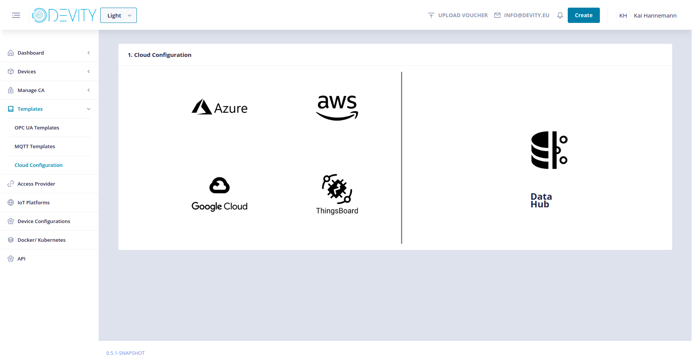
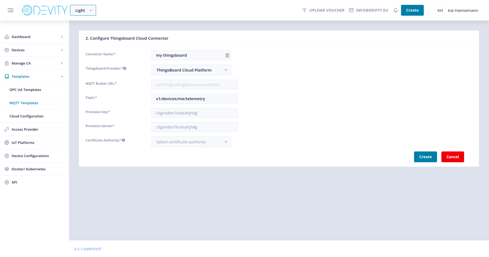
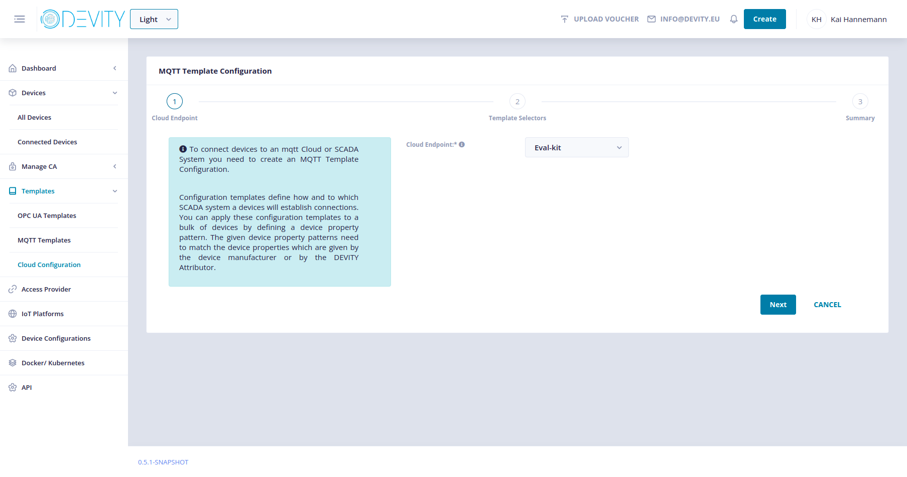
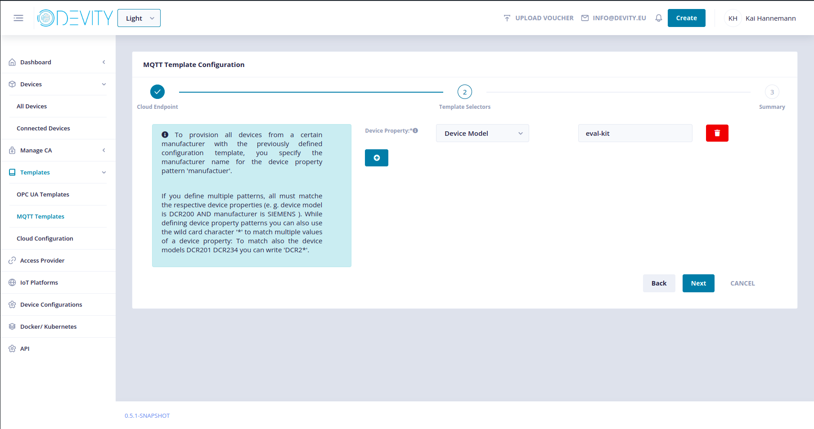

# Configuration

In this part you will configure the specifications that will be put onto the device.

Visit the **[configuration page](https://develop.carl.devity.eu)**.

**From here we need to include screenshots with guidence through the process. This is currently under construction until 0.5.0 is rolled out.** 

## Generate Templates

### Cloud Template

Start the configuration process by creating a new Cloud template.
It is used to tell the MQTT client the cloud endpoint it is connecting to.
Click on the "CREATE" button in the top right corner and select "Cloud Configuration".

Click on "Thingsboard" in the middle.

Fill with the following settings:

- Connector name: eval-kit
- Thingsboard Provider: Thingsboard Cloud Platform
- Broker URL: ssl://demo.mqtt.devity.eu
- Topic: v1/devices/me/telemetry
- Provision Key: "copy from thingsbord"
- Provision Secret: "copy from thingsboard"
- Certificate authority: demo CA-int-01

Submit with "CREATE".

### MQTT Template

After the cloud template is created you can use it to specify that your device recieves that configuration.
To do so, create a MQTT template by  clicking on the "CREATE" button again and select "MQTT Template".

Select "Cloud Endpoint" to be "eval-kit".

Click "NEXT" and fill in these device properties:
- Device Model: eval-kit

After this give the template a name and click on "Finish".

Now proceed to the Execution to finish the onboarding process.